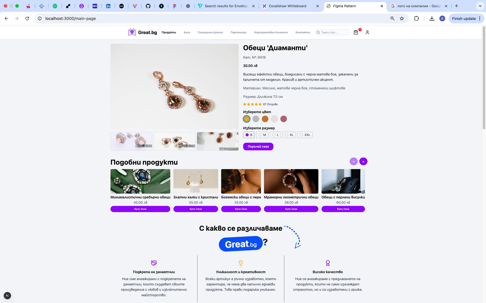
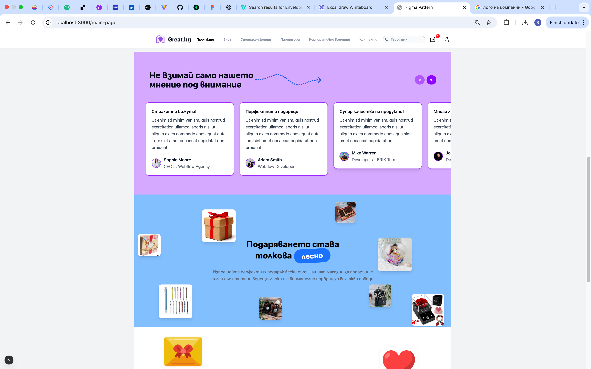
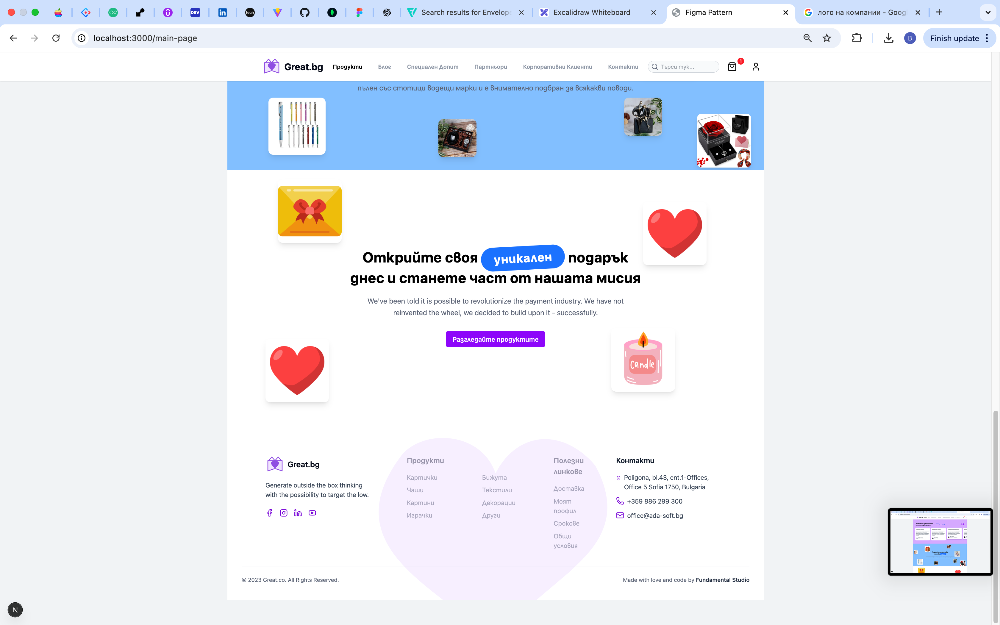

# Great.bg - Jewelry Products Showcase

**Description:**  
Great.bg is a modern web application built with **Next.js** and **Tailwind CSS** to showcase a variety of jewelry products, including earrings, necklaces, bracelets, and other accessories.

## Figma Design
The original Figma design file can be accessed here:  
[Figma Design for Great.bg](https://www.figma.com/design/IewHNgfcykduIDA5KT1rMm/Great.bg?node-id=315-698&t=dBBJSEJup8f1IpDo-1)

## Demo
<p align="center" style="display: flex; justify-content: center; gap: 10px;">
  
  
  
</p>


## Technologies
- **Next.js** - React framework for server-side rendering and routing
- **React** - For building interactive UI components
- **Tailwind CSS** - Utility-first CSS framework for styling
- **Node.js** - Backend runtime environment

## Features
- Product listing page for jewelry items
- Responsive design following Figma mockup
- Reusable React components for products, headers, and navigation
- Clean project structure following Next.js conventions
- High fidelity to design: spacing, typography, colors,buttons, and images

## Getting Started

To run this project locally, follow these steps:

1. Clone the repository:
   ```bash
   git clone <[Great.bg-Repository](https://github.com/B-D-2409/figmaToTailwind)>


   2. Navigate to the project folder:
   ```bash
   cd src
   ```

   3. Install dependencies:
   ```bash
   npm install
   ```

   4. Start the development server:
   ```bash
   npm run dev
   ```

   5. Open your browser and visit:
   ```bash
   http://localhost:3000
   ```
   The page should now be running locally!
